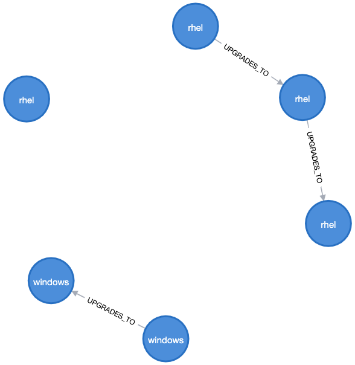
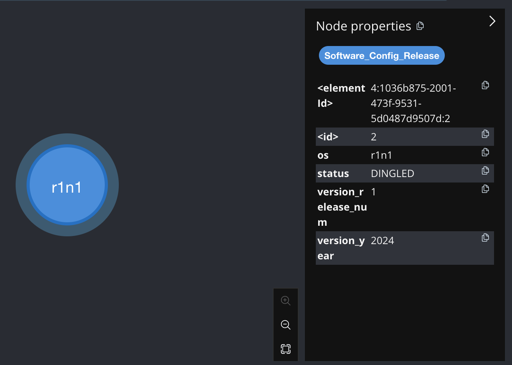
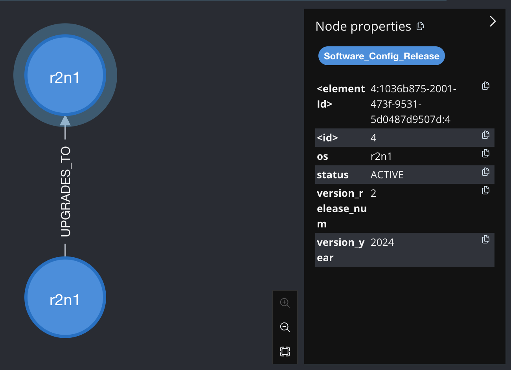
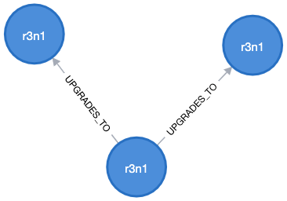
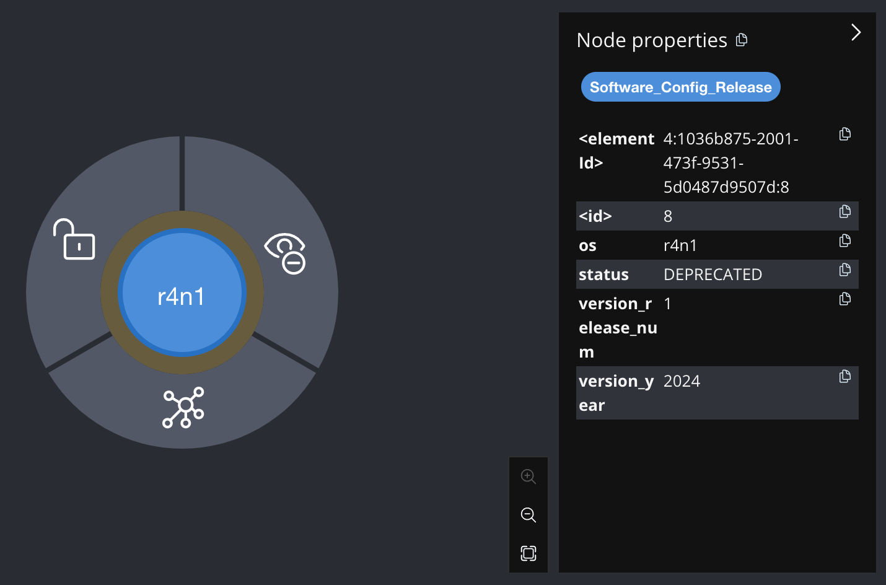
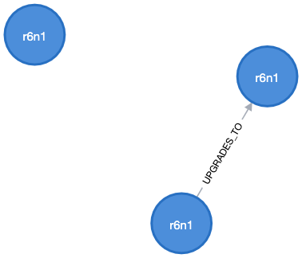
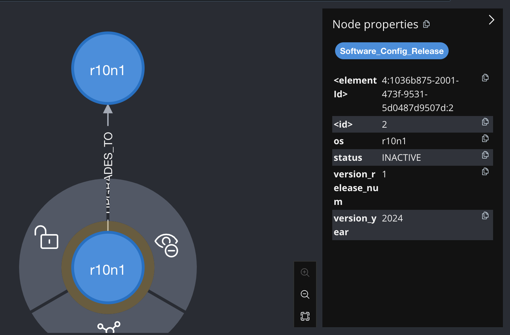

In a production environment, management is required for every software config release. We will use neo4j as an management tool to perform sanity check for software config releases.

### Software config release (SCR)
- one will be created per each release(e.g. major release, patches, OS upgrades...)
- Fields:
    - os_family: the intended OS that the software release to be run on
        - enum: ["rhel", "amazon_linux", "windows", "mac_os"]
    - version_year: int,
    - version_release_num: int
        - meta data of SCR, we use an example of `year-number`, e.g. 2024-01 means first release in year 2024
    - status: status of SCR
        - enum: ["PREFERRED", "ACTIVE", "DEPRECATED", "INACTIVE"]
        - PREFERRED: latest SCR. Other configs should upgrade to this
        - ACTIVE: SCR that is still valid and usable, but is upgradable to PREFERRED
        - DEPRECATED: SCR that is old and obsolete. It should be upgraded to ACTIVE/PREFERRED
        - INACTIVE: SCR that should not be used. Usually it is too old and have been deprecated for a while.

### rules for software config release
When we create new SCRs, we add upgrade path from old releases to the new SCR. We need to perform sanity check like no backward upgrade(i.e. downgrade), cycle upgrade...
1. All SCRs should only have status in the above 4 enums
1. All upgrade paths should have at least 1 PREFERRED destination
1. All upgrade paths should have only 1 PREFERRED destination
1. DEPRECATED SCRs must have an upgrade path
    - This does not applies to INACTIVE. As we would delink them and clean up later.
1. There should have no cycle in upgrade paths
1. For 1 os_family, we should have only 1 upgrade path
    - This ensures a single upgrade path for one OS to keep consistency
1. For 1 upgrade path, we should have only 1 os_family version along the way.
    - This ensures, says windows release will not be upgraded to linux releases
1. There should have only 1 upgrade destination for a SCR 
1. version should be strictly increasing in an upgrade path
    - no backward "upgrade"
1. INACTIVE SCR should have no upgrade path

### display all SCR
MATCH (Software_Config_Release) RETURN Software_Config_Release

-----------------------------------------------
### delete all SCR and upgrade paths
MATCH (Software_Config_Release) DETACH DELETE Software_Config_Release

-----------------------------------------------
### positive dataset p1
```
CREATE 
(a: Software_Config_Release {os: "rhel", version_year: 2024, version_release_num: 2, status: "PREFERRED"}),
(b: Software_Config_Release {os: "rhel", version_year: 2024, version_release_num: 1, status: "ACTIVE"}),
(c: Software_Config_Release {os: "rhel", version_year: 2023, version_release_num: 1, status: "DEPRECATED"}),
(d: Software_Config_Release {os: "rhel", version_year: 2022, version_release_num: 1, status: "INACTIVE"}),
(b)-[:UPGRADES_TO]->(a),
(c)-[:UPGRADES_TO]->(b),
(e: Software_Config_Release {os: "windows", version_year: 2024, version_release_num: 2, status: "PREFERRED"}),
(f: Software_Config_Release {os: "windows", version_year: 2024, version_release_num: 1, status: "ACTIVE"}),
(f)-[:UPGRADES_TO]->(e)
```


-----------------------------------------------

## rule 1: All SCRs should only have status in ["PREFERRED", "ACTIVE", "DEPRECATED", "INACTIVE"]

### negative dataset r1n1
```
CREATE 
(r1n1: Software_Config_Release {os: "r1n1", version_year: 2024, version_release_num: 2, status: "PREFERRED"}),
(r1n2: Software_Config_Release {os: "r1n1", version_year: 2024, version_release_num: 1, status: "DINGLED"})
```


### test for rule 1
```
MATCH (Software_Config_Release) 
WHERE NOT(Software_Config_Release.status IN ["PREFERRED", "ACTIVE", "DEPRECATED", "INACTIVE"])
RETURN Software_Config_Release
```

expected return: 0

-----------------------------------------------

## rule 2: All upgrade paths should have at least 1 PREFERRED destination

### negative dataset r2n1
```
CREATE 
(r2n1: Software_Config_Release {os: "r2n1", version_year: 2024, version_release_num: 1, status: "ACTIVE"}),
(r2n2: Software_Config_Release {os: "r2n1", version_year: 2024, version_release_num: 2, status: "ACTIVE"}),
(r2n1)-[:UPGRADES_TO]->(r2n2)
```


### test for rule 2
```
MATCH (dest_scr) WHERE NOT EXISTS ((dest_scr)-[]->())
WITH dest_scr
MATCH (src_scr)-[]->(dest_scr)
WHERE dest_scr.status <> "PREFERRED"
RETURN src_scr, dest_scr


MATCH (dest_scr) WHERE NOT EXISTS ((dest_scr)-[]->())
WITH dest_scr
MATCH (src_scr)-[]->(dest_scr)
WITH src_scr, dest_scr, COLLECT(dest_scr) as destinations_cnt
WHERE SIZE(destinations_cnt) > 1
RETURN src_scr, dest_scr
```

expected return: 0

-----------------------------------------------

## rule 3: All upgrade paths should have only 1 PREFERRED destination

### negative dataset r3n1
```
CREATE 
(r3n1: Software_Config_Release {os: "r3n1", version_year: 2024, version_release_num: 1, status: "ACTIVE"}),
(r3n2: Software_Config_Release {os: "r3n1", version_year: 2024, version_release_num: 2, status: "PREFERRED"}),
(r3n3: Software_Config_Release {os: "r3n1", version_year: 2024, version_release_num: 3, status: "PREFERRED"}),
(r3n1)-[:UPGRADES_TO]->(r3n2),
(r3n1)-[:UPGRADES_TO]->(r3n3)
```


### test for rule 3
```
MATCH (scr1)-->(scr2)
WITH scr1, COLLECT(scr2) AS destinations
WHERE SIZE(destinations) > 1
RETURN scr1, destinations
```

expected return: 0

-----------------------------------------------

## rule 4: DEPRECATED SCRs must have an upgrade path

### negative dataset r4n1
```
CREATE 
(r4n1: Software_Config_Release {os: "r4n1", version_year: 2024, version_release_num: 1, status: "DEPRECATED"})
```


### test for rule 4
```
MATCH (src_scr) 
WHERE NOT EXISTS ((src_scr)-[]->()) AND src_scr.status = "DEPRECATED"
RETURN src_scr
```

expected return: 0

-----------------------------------------------

## rule 5: There should have no cycle in upgrade paths

### negative dataset r5n1
```
CREATE 
(r5n1: Software_Config_Release {os: "r5n1", version_year: 2024, version_release_num: 1, status: "ACTIVE"}),
(r5n2: Software_Config_Release {os: "r5n1", version_year: 2024, version_release_num: 1, status: "ACTIVE"}),
(r5n1)-[:UPGRADES_TO]->(r5n2),
(r5n2)-[:UPGRADES_TO]->(r5n1)
```


### test for rule 5
```
MATCH scr=(scr1)-[*]->(scr1) 
RETURN nodes(scr)

MATCH scr=(scr1)-[*1..15]->(scr1) 
RETURN nodes(scr)
```

expected return: 0

-----------------------------------------------

## rule 6: For 1 os_family, we should have only 1 upgrade path

### negative dataset r6n1
```
CREATE 
(r6n1: Software_Config_Release {os: "r6n1", version_year: 2024, version_release_num: 1, status: "ACTIVE"}),
(r6n2: Software_Config_Release {os: "r6n1", version_year: 2024, version_release_num: 1, status: "ACTIVE"}),
(r6n1)-[:UPGRADES_TO]->(r6n2),
(r6n3: Software_Config_Release {os: "r6n1", version_year: 2024, version_release_num: 1, status: "ACTIVE"})
```


### test for rule 6
```
MATCH (scr1) 
WHERE NOT EXISTS { (scr1)-[]-(scr2) WHERE scr1.os = scr2.os AND id(scr1) > id(scr2) }
AND scr1.status <> "INACTIVE"
WITH scr1.os AS os, count(*) AS numClusters
WHERE numClusters > 1
RETURN os, numClusters
```

expected return: 0

-----------------------------------------------

## rule 7: For 1 upgrade path, we should have only 1 os_family version along the way.

### negative dataset r7n1
```
CREATE 
(r7n1: Software_Config_Release {os: "r7n1", version_year: 2024, version_release_num: 1, status: "ACTIVE"}),
(r7n2: Software_Config_Release {os: "r7n2", version_year: 2024, version_release_num: 1, status: "ACTIVE"}),
(r7n1)-[:UPGRADES_TO]->(r7n2)
```


### test for rule 7
```
MATCH (scr1)-[]-(scr2)
WHERE scr1.os <> scr2.os
RETURN scr1
```

expected return: 0

-----------------------------------------------

## rule 8: There is only 1 upgrade destination for a SCR

### negative dataset r8n1
```
CREATE 
(r8n1: Software_Config_Release {os: "r8n1", version_year: 2024, version_release_num: 1, status: "ACTIVE"}),
(r8n2: Software_Config_Release {os: "r8n1", version_year: 2024, version_release_num: 2, status: "PREFERRED"}),
(r8n3: Software_Config_Release {os: "r8n1", version_year: 2024, version_release_num: 3, status: "ACTIVE"}),
(r8n1)-[:UPGRADES_TO]->(r8n2),
(r8n1)-[:UPGRADES_TO]->(r8n3)
```


### test for rule 8
```
MATCH (scr1)-->(scr2)
WITH scr1, COLLECT(scr2) AS destinations
WHERE SIZE(destinations) > 1
RETURN scr1, destinations
```

expected return: 0

-----------------------------------------------

## rule 9: version should be strictly increasing in an upgrade path

### negative dataset r9n1
```
CREATE 
(r9n1: Software_Config_Release {os: "r9n1", version_year: 2024, version_release_num: 1, status: "ACTIVE"}),
(r9n2: Software_Config_Release {os: "r9n1", version_year: 2023, version_release_num: 2, status: "PREFERRED"}),
(r9n1)-[:UPGRADES_TO]->(r9n2),
(r9n3: Software_Config_Release {os: "r9n1", version_year: 2024, version_release_num: 2, status: "ACTIVE"}),
(r9n4: Software_Config_Release {os: "r9n1", version_year: 2024, version_release_num: 1, status: "PREFERRED"}),
(r9n3)-[:UPGRADES_TO]->(r9n4)
```


### test for rule 9
```
MATCH (scr1)-[]->(scr2)
WITH scr1, scr2, COLLECT(scr2) AS destinations
WHERE scr1.version_year > scr2.version_year OR (scr1.version_year <= scr2.version_year AND scr1.version_release_num > scr2.version_release_num)
RETURN scr1, destinations
```

```
╒══════════════════════════════════════════════════════════════════════╤══════════════════════════════════════════════════════════════════════╕
│scr1                                                                  │destinations                                                          │
╞══════════════════════════════════════════════════════════════════════╪══════════════════════════════════════════════════════════════════════╡
│(:Software_Config_Release {version_year: 2024,os: "r9n1",version_relea│[(:Software_Config_Release {version_year: 2023,os: "r9n1",version_rele│
│se_num: 1,status: "ACTIVE"})                                          │ase_num: 2,status: "PREFERRED"})]                                     │
├──────────────────────────────────────────────────────────────────────┼──────────────────────────────────────────────────────────────────────┤
│(:Software_Config_Release {version_year: 2024,os: "r9n1",version_relea│[(:Software_Config_Release {version_year: 2024,os: "r9n1",version_rele│
│se_num: 2,status: "ACTIVE"})                                          │ase_num: 1,status: "PREFERRED"})]                                     │
└──────────────────────────────────────────────────────────────────────┴──────────────────────────────────────────────────────────────────────┘
```

expected return: 0


-----------------------------------------------

## rule 10: INACTIVE SCR should have no upgrade path

### negative dataset r10n1
```
CREATE 
(r10n1: Software_Config_Release {os: "r10n1", version_year: 2024, version_release_num: 1, status: "INACTIVE"}),
(r10n2: Software_Config_Release {os: "r10n1", version_year: 2024, version_release_num: 2, status: "PREFERRED"}),
(r10n1)-[:UPGRADES_TO]->(r10n2)
```


### test for rule 10
```
MATCH (scr1)-[]->(scr2)
WITH scr1, collect(scr2) AS destinations
WHERE scr1.status = "INACTIVE"
RETURN scr1, destinations
```

expected return: 0